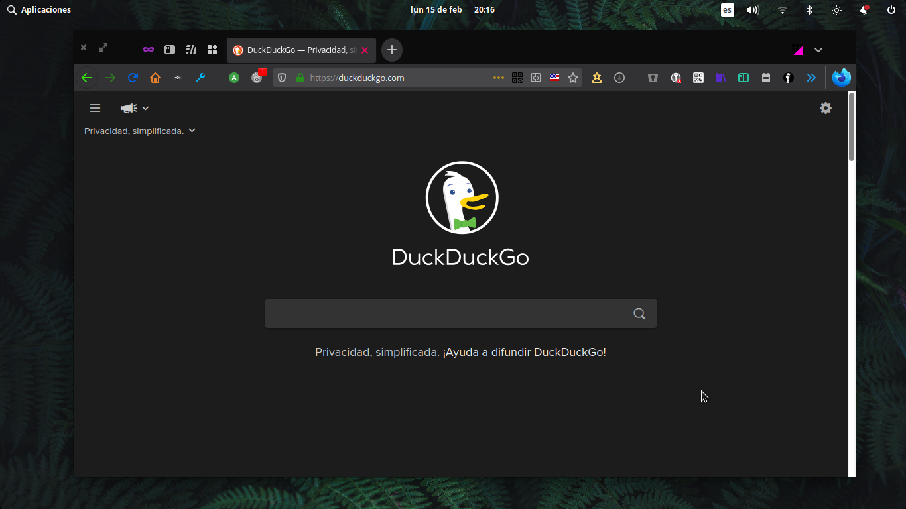
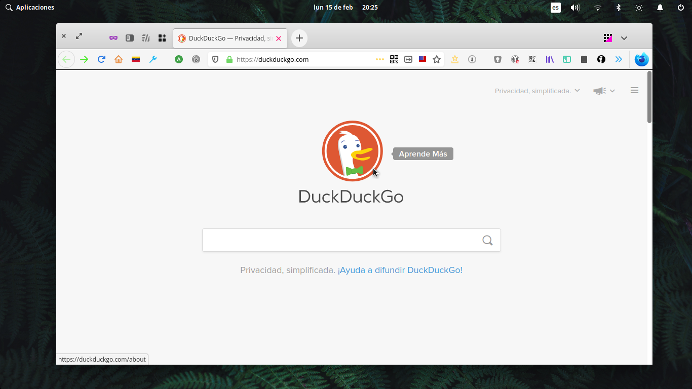
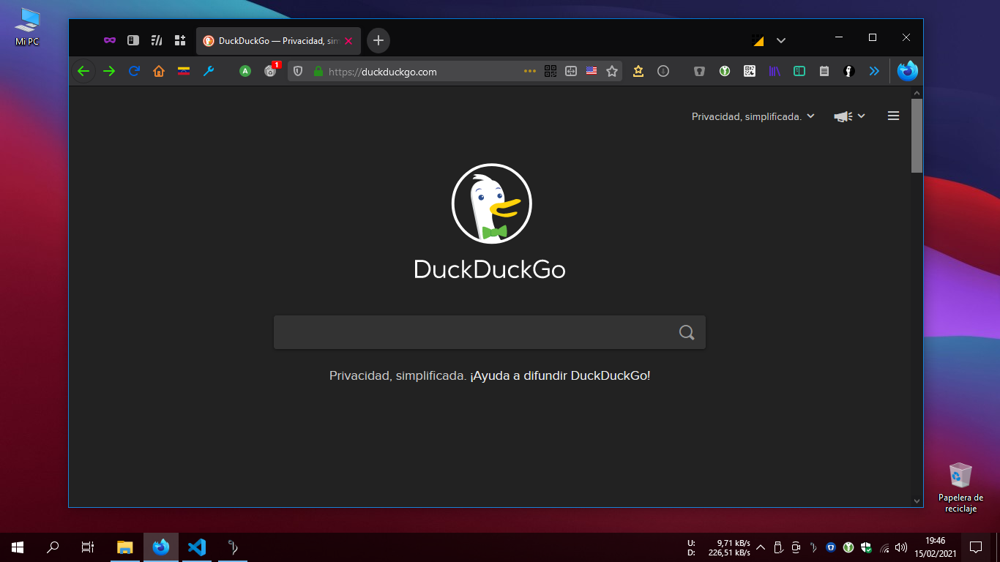
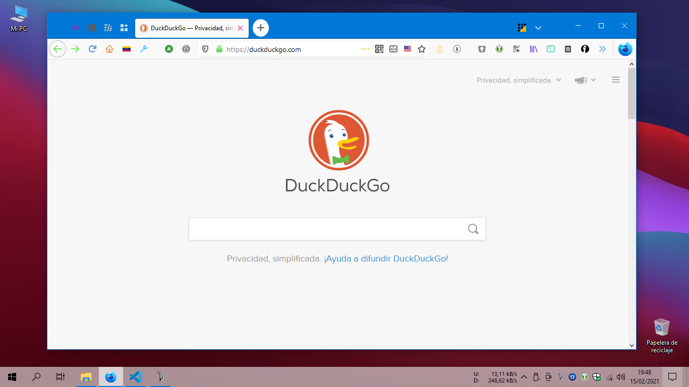
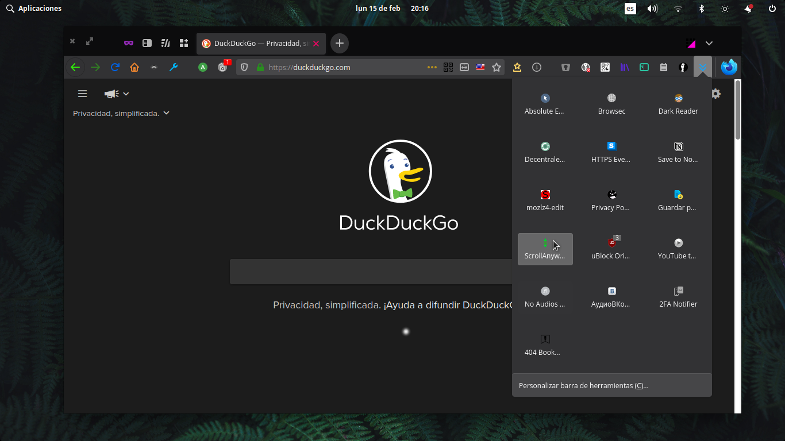
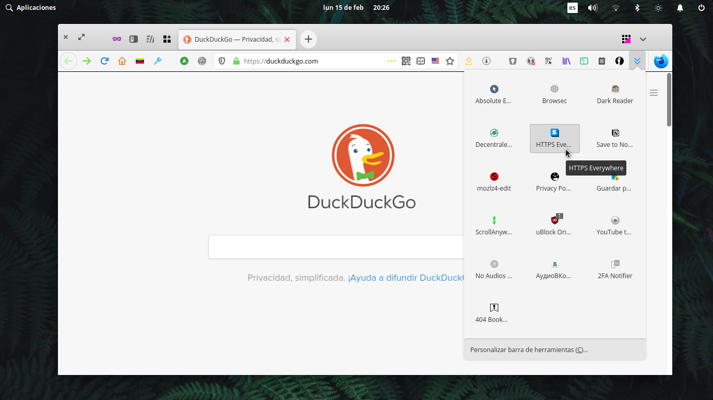
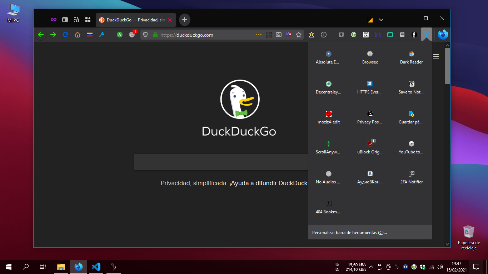
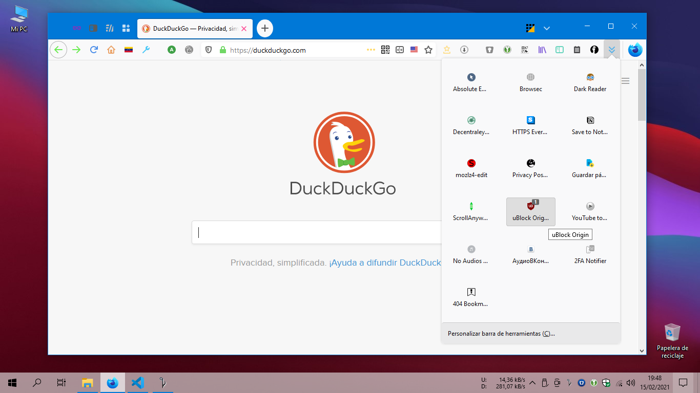

# Firefox-Browser-Proton-Custom
  A custom userChrome.css for Firefox 86+ ([Beta](https://www.mozilla.org/en-US/firefox/all/#product-desktop-beta), [Developer](https://www.mozilla.org/en-US/firefox/all/#product-desktop-developer) and [Nightly](https://www.mozilla.org/en-US/firefox/all/#product-desktop-nightly) for February 2021).
  **For personal purpose only.**
  

(Firefox Browser Proton Custom - Firefox Browser 86 Developer Edition - elementary OS Dark Theme)

(Firefox Browser Proton Custom - Firefox Browser 86 Developer Edition - elementary OS DefaultTheme)

(Firefox Browser Proton Custom - Firefox Browser 86 Developer Edition - Windows 10 Dark Theme)

(Firefox Browser Proton Custom - Firefox Browser 86 Developer Edition - Windows 10 Default Theme)

## How to?

* Your must enable via `about:config` the `toolkit.legacyUserProfileCustomizations.stylesheets` in Firefox.

* Download the [userChrome.css](userChrome.css) file (for Firefox Browser 86+ version) and save it (*right-click* -> *Save Link As...*) to your `Roaming\Mozilla\Firefox\Profiles\[User]\chrome` folder (`%APPDATA%\Mozilla\Firefox\Profiles\` on Windows) or go to `about:profiles` (in Firefox) and locate the `Roaming` folder of your profile.

* Restart Firefox to see the changes.

## Features?

**Firefox-Browser-Proton-Custom** is a more "cleaner" version of my custom [Firefox-Browser-UI-Custom](https://github.com/gabeweb/Firefox-Browser-UI-Custom/)
and aditionally has some extra things like:

- Revert to some Firefox standard items, but keeping the customized url-bar, close button hovering over unselectd tabs, **widgtets panel** and useful ***go-arrow*** button.

(Firefox Browser Proton Custom - Firefox Browser 86 Developer Edition - elementary OS Dark Theme)

(Firefox Browser Proton Custom - Firefox Browser 86 Developer Edition - elementary OS Default Theme

(Firefox Browser Proton Custom - Firefox Browser 86 Developer Edition - Windows 10 Dark Theme)

(Firefox Browser Proton Custom - Firefox Browser 86 Developer Edition - Windows 10 Default Theme)

But first you must verify that you have these parameters activated via *about:config*:

- `browser.proton.enabled` and `browser.proton.tabs.enabled` must be ***true***

This *userChrome.css* file use code snippets collected from other sources, so the credits (mostly) are for their authors:

* https://github.com/axydavid/FirefoxUI
* https://github.com/gabeweb/Firefox-Quantum-UI-Lite
* https://github.com/muckSponge/MaterialFox
* https://github.com/coekuss/quietfox
* https://github.com/Timvde/UserChrome-Tweaks
* https://www.reddit.com/r/FirefoxCSS/

## Bugs?

Yes, the theme is a fork of forks of other projects, so there are many bugs in the code, for example the context menus do not properly reflect the shadows in all environments, nor does the background color of the side panel context menus change (Firefox Browser Nightly 78 "breaks" some things).

I'm not a programmer, but at least I tried to make a new theme for al Firefox users 🤘🏻

**Suggestions and ideas are very, very welcome!**
